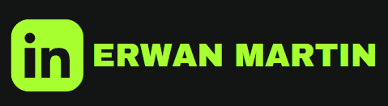

# Portfolio Github

Last Edited Time: June 23, 2022 10:19 PM

## **Hi there! I’m Erwan** 👋

I’m a robotics research engineer apprentice. To see my projects, look at my repositories!

**⚡️ Quick Facts:**

- I am currently looking for an internship in robotics in a foreign country (USA or UK are my wanted destinations) 🗺️
- I am the president of the CESI Experimental Robotics, my school’s robotics club 🤖
- I am posting some video projects on my Linkedin

🔄 **Current position:** 

- CESI engineering school - Computer sciences engineering student
- CESI Lineact : Robotics research engineer apprentice

**🦾 Currently working on**:

- School : pathfinding algorithm project
- Laboratory: several robot control → production line
- Robotics: Clubs : Building a BB8, Real size
- Personal: Robotic arm prothesis

## **🚀 Some Tools I mostly work with**

<!--
**R1leMargoulin/R1leMargoulin** is a ✨ _special_ ✨ repository because its `README.md` (this file) appears on your GitHub profile.

Here are some ideas to get you started:

- 🔭 I’m currently working on ...
- 🌱 I’m currently learning ...
- 👯 I’m looking to collaborate on ...
- 🤔 I’m looking for help with ...
- 💬 Ask me about ...
- 📫 How to reach me: ...
- 😄 Pronouns: ...
- ⚡ Fun fact: ...
-->
